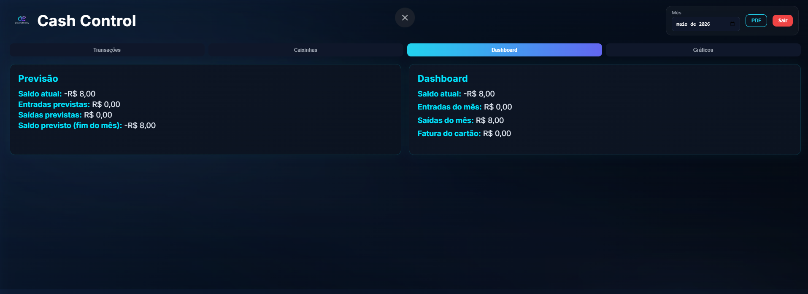
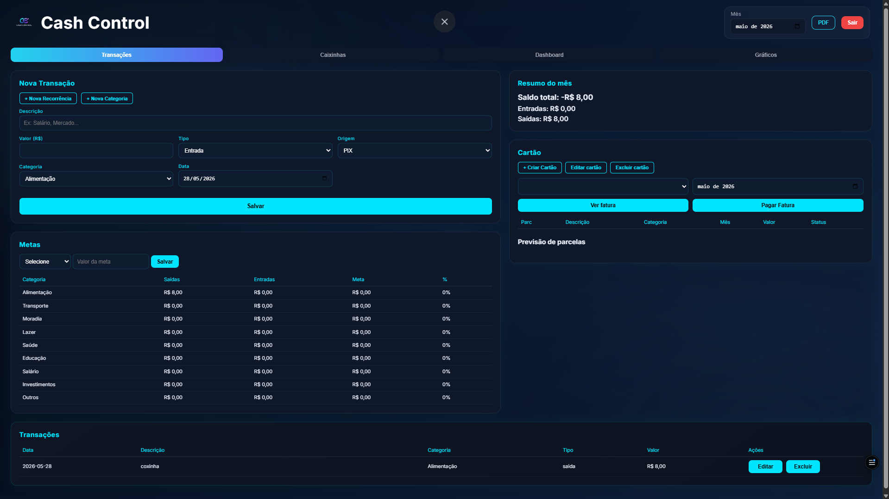
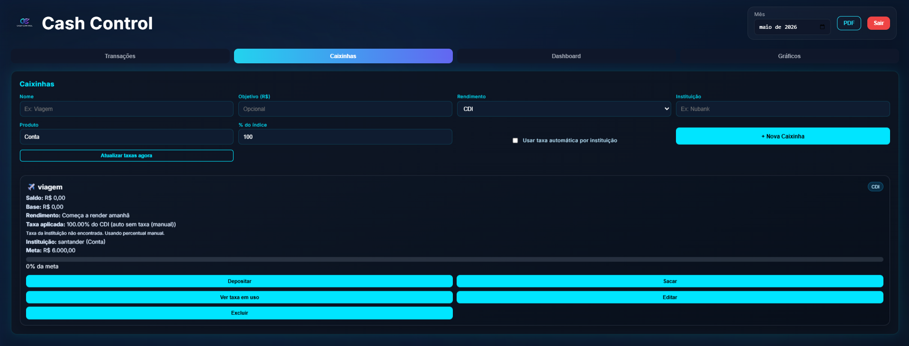
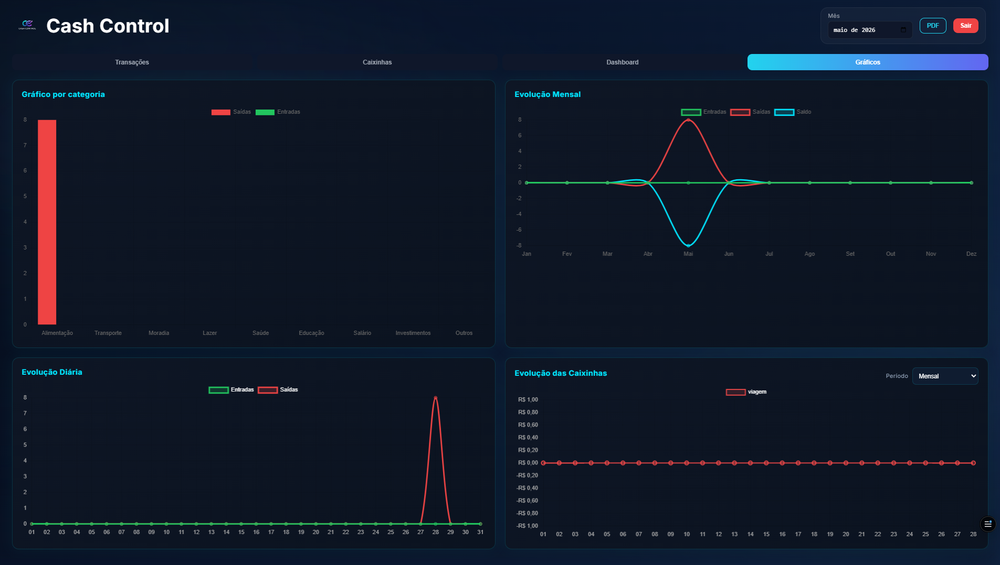

<h1 align="center">
  <br/>
  CashControl
</h1>

<p align="center">
  Controle financeiro pessoal moderno — disponível como <strong>PWA</strong> (instale no celular ou desktop sem precisar de loja de apps).
</p>

<p align="center">
  
  
  
  
  
</p>

---

## Screenshots

> _Adicione prints do app aqui — basta arrastar as imagens para esta seção no GitHub._

| Dashboard | Transações |
|:---------:|:----------:|
|  |  |

| Caixinhas | Gráficos |
|:---------:|:--------:|
|  |  |

---

## Funcionalidades

- **Transações** — registro de entradas e saídas com categorias, recorrências e parcelamento
- **Cartão de crédito** — controle de faturas, parcelas e limites por cartão
- **Caixinhas** — objetivos financeiros com simulação de rendimento (CDI, CDB, Poupança)
- **Dashboard** — resumo mensal, previsão de saldo e metas por categoria
- **Gráficos** — evolução diária, mensal e por categoria
- **Relatório PDF** — exportação do extrato mensal
- **PWA** — instalável no celular e desktop, funciona como app nativo

---

## Stack

| Camada | Tecnologia |
|--------|-----------|
| Backend | Node.js + Express 5 |
| Banco de dados | PostgreSQL (Neon) |
| Frontend | Vanilla JS + Chart.js |
| Autenticação | JWT + bcryptjs |
| E-mail | Nodemailer (Gmail) |
| PDF | PDFKit |
| Deploy | Vercel |

---

## Rodando localmente

### Pré-requisitos

- Node.js 18+
- Conta no [Neon](https://neon.tech) (banco PostgreSQL gratuito)

### Configuração

```bash
# 1. Clone o repositório
git clone https://github.com/Lipezin007/CashControl.git
cd CashControl

# 2. Instale as dependências
npm install

# 3. Configure as variáveis de ambiente
cp .env.example .env
# Edite o .env com sua DATABASE_URL do Neon e demais variáveis

# 4. Inicie o servidor
npm start
# Acesse http://localhost:3000
```

### Variáveis de ambiente

Copie o [.env.example](.env.example) e preencha:

| Variável | Descrição |
|----------|-----------|
| `DATABASE_URL` | Connection string do Neon (com `?sslmode=require`) |
| `JWT_SECRET` | Chave secreta para tokens JWT |
| `SMTP_USER` | E-mail Gmail para recuperação de senha |
| `SMTP_PASS` | App Password do Gmail |
| `NODE_ENV` | `production` em deploy |

---

## Deploy (Vercel + Neon)

1. **Neon** — crie um projeto em [neon.tech](https://neon.tech) e copie a **Connection string (Pooler)**
2. **Vercel** — importe o repositório e adicione as variáveis de ambiente
3. O `vercel.json` já está configurado — o deploy é automático a cada push

---

## Estrutura do projeto

```
├── api/
│   └── index.js          # Entry point serverless (Vercel)
├── backend/
│   ├── server.js          # Express + rotas
│   ├── queries.js         # Lógica de negócio / SQL
│   ├── initDB.js          # Schema PostgreSQL
│   ├── db.js              # Pool de conexão pg
│   └── rendimentoService.js  # Integração BrasilAPI (CDI)
├── src/
│   ├── index.html         # App principal
│   ├── login.html         # Tela de acesso
│   ├── app.js             # Lógica do frontend
│   ├── style.css          # Estilos
│   ├── manifest.json      # PWA manifest
│   └── sw.js              # Service Worker
├── .env.example
├── vercel.json
└── Procfile
```

---

## Licença

ISC — [Felippe Pedroso](https://github.com/Lipezin007)
